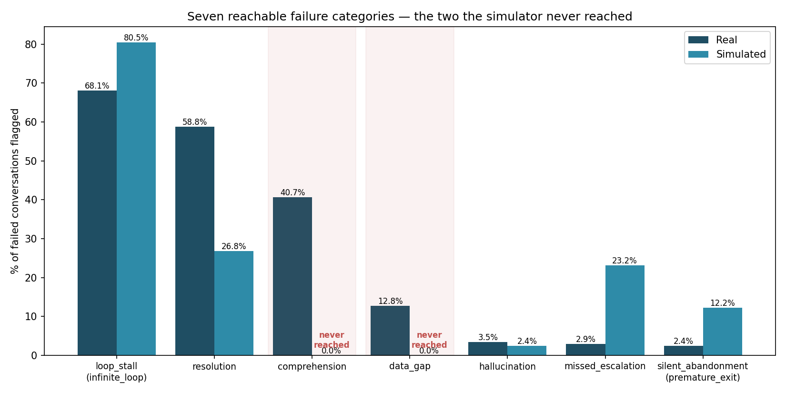
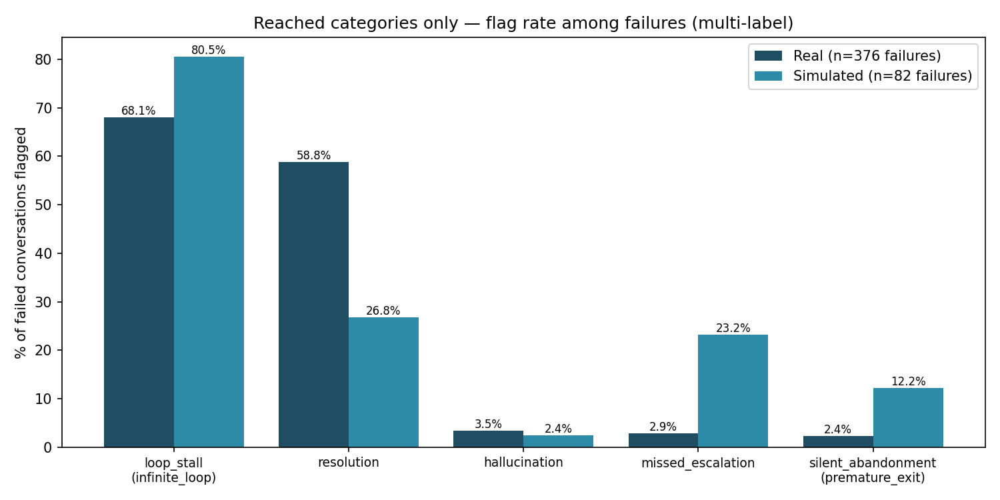
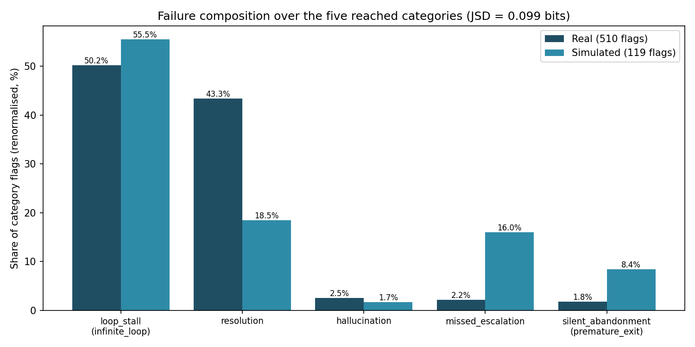
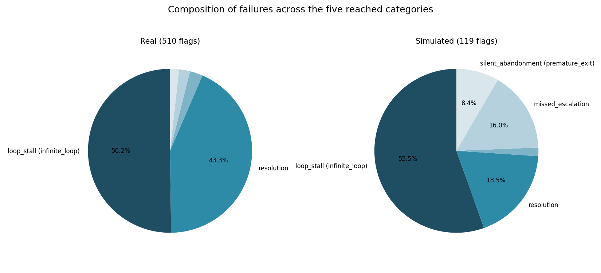

# The Five Reached Categories — and Why Two Could Never Be Reached

**Companion document.** The main comparison report (`docs/results/real_vs_sim/REPORT.md`) presents all seven reachable failure categories side by side and is left unchanged. This document does two things that report deliberately does not:

1. It **explains, in depth, why two of the seven categories — `comprehension` and `data_gap` — never appeared in simulation**, at any scale, and why this is a structural property of the simulation design rather than bad luck or insufficient sampling.
2. It **re-presents the real-vs-simulated comparison restricted to the five categories the simulator actually reached**, with percentages renormalised over that five-category support, so the two corpora can be compared like-for-like on the ground where both can actually compete.

Sources: `docs/results/real_vs_sim/real_vs_sim.json` (scorer-parity comparison, taxonomy `1.0-frozen-2026-07-14`, min_score = 3.0), the scale study (`docs/results/real_vs_sim/scale/SCALE_REPORT.md`), and the charts + numbers in `docs/` generated by `debugger-platforn/reached_only_charts.py`. Corpora: 1,299 real production conversations (376 failures, 28.9%) vs 390 live-agent simulated conversations (82 failures, 21.0%), both scored by the **identical** rule-based production scorer.

---

## 1. Quick recap: the seven categories

The frozen taxonomy contains eight production-observable failure categories. One of them, `delivery_infra` (WhatsApp message-delivery and infrastructure failures, 14 real occurrences), is **unreachable by design**: the simulator talks to the agent over HTTP and has no WhatsApp transport layer, so there is physically nothing that could fail in that way. It is excluded from all coverage claims up front, which leaves the **seven reachable categories** the main report discusses:

| category | what it means | real failures flagged |
|---|---|---|
| `loop_stall` (infinite_loop) | agent repeats itself / conversation goes in circles | 256 (68.1%) |
| `resolution` | agent understood but couldn't resolve; user demanded a human | 221 (58.8%) |
| `comprehension` | agent did not understand what the user needed | 153 (40.7%) |
| `data_gap` | backend/tool data missing or incomplete | 48 (12.8%) |
| `hallucination` | agent fabricated information, customer pushed back | 13 (3.5%) |
| `missed_escalation` | frustrated user, agent failed to hand off | 11 (2.9%) |
| `silent_abandonment` (premature_exit) | conversation died without closure | 9 (2.4%) |

(Percentages are of the 376 failed real conversations; categories are multi-label, so they sum to more than 100%.)

Of these seven, the simulator reproduced **five**. The two it never reproduced — `comprehension` and `data_gap` — are not fringe categories: together they account for the **first and fourth most common** real failure modes, and comprehension alone is present in over 40% of real failures. Understanding *why* they never show up matters more than the coverage number itself.

---

## 2. The two categories that were never reached

### 2.1 `comprehension` — the simulated customers are too polite, too clear, and too cooperative

**What the category captures in production.** A comprehension failure is flagged when the *customer's* behaviour signals the agent didn't understand them — most observably, the customer repeating or re-sending essentially the same request because the agent answered something else. Real WhatsApp customers produce this signal constantly: they write fragmented messages, use slang and regional abbreviations, mix topics in one message, make typos, send a single word ("precio??"), follow up with "?" or "hola?" when ignored, and — crucially — when the agent misunderstands them, they **repeat themselves verbatim**, often with escalating frustration.

**Why the simulator can't produce it.** The simulated customers are themselves LLM personas, and LLM-generated users are systematically *over-cooperative*. When the agent under test gives a confusing or off-target answer, the persona does not do what a real annoyed customer does (paste the same message again, or reply "no, eso no es lo que pregunté"). Instead it behaves like a model trained to be helpful: it **rephrases** its request more clearly, adds context, answers the agent's clarifying questions patiently, and generally *repairs* the conversation. Grammatically clean, well-structured, single-intent messages are also exactly the inputs the agent under test comprehends best — so the persona's politeness attacks the failure mode from both sides: it makes misunderstanding less likely to occur, and when it does occur, it erases the behavioural evidence (verbatim repetition) that the scorer needs to flag it. This over-cooperative-simulated-user effect is a documented phenomenon in the user-simulation literature (the "Lost in Simulation" line of work), not something unique to this project.

There is a secondary, telemetry-side reason the reachability matrix records this category as only *partially* reachable even in principle: part of the production comprehension signal comes from intent/confidence telemetry emitted by the production stack, which simply does not exist in the simulation harness. The customer-repeat behavioural signal is observable in sim — it just never fires, for the reasons above.

**In one sentence:** real customers get confused and grind; LLM personas clarify and cooperate, so the behaviour that *defines* a comprehension failure never happens.

### 2.2 `data_gap` — a fully-seeded fake database has no gaps

**What the category captures in production.** A data-gap failure occurs when the agent does everything right conversationally but the *backend lets it down*: the customer's record is missing, an order isn't in the system yet, a field is stale or empty, a lookup returns nothing. The failure originates in the data environment, not in the agent's reasoning. In the real corpus this is 12.8% of failures — real CRMs are messy.

**Why the simulator can't produce it.** The simulation environment runs the agent against a **single, deliberately fully-seeded fake customer database**. That database was built so that every tool call the agent might make has a complete, well-formed answer — which is exactly what you want when the thing under test is the *agent's behaviour*, and exactly what makes data-gap failures *logically impossible*. Every lookup succeeds; every record exists; every field is populated. There is no incomplete state anywhere in the environment for the agent to stumble over, so no amount of simulated conversations can surface this category. The failure mode lives in the environment, and the environment was built without it.

**In one sentence:** you cannot discover missing-data failures in a world where no data is ever missing.

### 2.3 Why we can say this is structural, not a sampling accident

If the two categories were merely *rare* in simulation, running more simulations would eventually find them. The scale study rules this out. Seven independent batches were run at N = 10, 50, 100, 200, 400, 800, and 1,000 conversations, plus a pooled corpus of 2,560:

- `comprehension` occurrences in sim: **0, at every N, and 0 in the pooled 2,560.**
- `data_gap` occurrences in sim: **0, at every N, and 0 in the pooled 2,560.**
- Category coverage sits at exactly **5/7 (71%) from N = 50 all the way to N = 1,000** — the curve saturates almost immediately and never moves again. Scaling grows failure *volume* linearly but adds no new failure *kinds*.

A 100× increase in simulation budget changed nothing, which is the empirical signature of a structural ceiling: the generating process for these two categories is absent, not undersampled. Buying more of the same simulations buys zero additional coverage; reaching these categories requires *different* simulations (see §5).

---

## 3. The five reached categories, renormalised

### 3.1 How to read these percentages (methodology note)

The main report expresses each category as a share of *failed conversations* (multi-label: one failed conversation can carry several category flags, so columns sum to more than 100%). That framing is kept in the first chart below. For the composition comparison, however, the percentages are **renormalised over the five-category support**: each category's flag count is divided by the total number of flags across the five reached categories (real: 510 flags across 376 failures; sim: 119 flags across 82 failures). This answers the question the raw rates cannot: *given only the failure kinds both worlds can express, how does the failure mass distribute — and does simulation distribute it the way reality does?* Zeroed-out categories no longer distort the comparison, and the two corpora are judged only on ground where both can compete. Note the renormalised shares describe the composition of **flags**, not of conversations.

### 3.2 The numbers

| category | real count | real % of failures | sim count | sim % of failures | real share (5-cat) | sim share (5-cat) |
|---|---|---|---|---|---|---|
| `loop_stall` | 256 | 68.1% (CI 63.2–72.6) | 66 | 80.5% (CI 70.6–87.6) | **50.2%** | **55.5%** |
| `resolution` | 221 | 58.8% (CI 53.7–63.6) | 22 | 26.8% (CI 18.4–37.3) | **43.3%** | **18.5%** |
| `hallucination` | 13 | 3.5% (CI 2.0–5.8) | 2 | 2.4% (CI 0.7–8.5) | **2.5%** | **1.7%** |
| `missed_escalation` | 11 | 2.9% (CI 1.6–5.2) | 19 | 23.2% (CI 15.4–33.4) | **2.2%** | **16.0%** |
| `silent_abandonment` | 9 | 2.4% (CI 1.3–4.5) | 10 | 12.2% (CI 6.8–21.0) | **1.8%** | **8.4%** |

(CIs are Wilson 95% intervals on the rate-of-failures; from `real_vs_sim.json`.)

### 3.3 Flag rates among failures — the direct comparison

Reading this chart category by category:

- **`loop_stall` — reproduced, and dominant in both worlds (68.1% real vs 80.5% sim).** This is the strongest correspondence result in the whole study: the single most common way the real agent fails — getting stuck repeating itself — is also the single most common way it fails under simulation, at a comparable magnitude. Loop behaviour is a property of the *agent* (its retry logic, its inability to break out of a clarification cycle), so it transfers into any environment that lets the conversation run long enough. The simulator slightly *over*-expresses it, plausibly because personas dutifully keep responding where real customers would have quit, giving loops more room to manifest.
- **`resolution` — reproduced but substantially under-produced (58.8% real vs 26.8% sim).** Resolution failures need a customer who *insists on an outcome the agent can't deliver* and escalates their demand for a human. The same persona politeness that eliminates comprehension failures dampens this one: simulated customers accept partial answers and let the agent off the hook, where real customers keep pushing until the failure is undeniable. The category survives in sim only because some scenario scripts explicitly direct the persona to demand things the agent can't do.
- **`hallucination` — reproduced at close to the real rate (3.5% vs 2.4%).** A small category in both worlds, and the sim rate lands inside sampling noise of the real one. Hallucination is agent-internal — it doesn't depend on the customer being realistic — which is exactly why it transfers cleanly.
- **`missed_escalation` — reproduced but heavily over-produced (2.9% vs 23.2%, ~8×).** The mirror image of the comprehension story: several test scenarios *deliberately script* frustrated personas who demand a human, precisely to probe the escalation path. The simulator therefore concentrates escalation pressure far above its natural production frequency. This is over-representation by test design, not a discovery error — but it means the sim rate measures how the agent handles engineered escalation pressure, not how often that pressure arises organically.
- **`silent_abandonment` — reproduced but over-produced (2.4% vs 12.2%, ~5×).** Simulated conversations have hard turn budgets and personas with finite scripted patience, so conversations end without closure more often than in production, where the customer's abandonment is the tail event.

The overall pattern is coherent rather than random: **agent-internal failure modes (loops, hallucination) transfer at close to their real magnitudes; customer-driven failure modes are distorted in whichever direction the persona design pushes them** — suppressed where personas are too polite (resolution, and comprehension to the point of extinction), inflated where scenarios script the pressure in (escalation, abandonment).

### 3.4 Composition over the five-category support

Renormalised, the real failure mass is essentially a **two-mode distribution**: loops (50.2%) plus resolution (43.3%) account for 93.5% of all real flags on this support, with hallucination, escalation, and abandonment sharing the remaining 6.5%. The simulated distribution reproduces the headline structure — **`loop_stall` is the plurality mode in both, at nearly the same share (50.2% real vs 55.5% sim)** — but redistributes the rest: resolution's share drops from 43.3% to 18.5%, and the freed mass flows into the two scripted-pressure categories, `missed_escalation` (2.2% → 16.0%) and `silent_abandonment` (1.8% → 8.4%).

Quantitatively, the Jensen–Shannon divergence between the two renormalised five-category distributions is **0.099 bits** — versus **0.239 bits** on the seven-category reachable support used in the main report (real split-half noise floor: 0.005). In other words, **more than half of the headline distributional divergence is attributable to the two structurally-zeroed categories**, not to the simulator mis-ranking the failure modes it can actually express. On the ground where both corpora can compete, the simulated failure distribution is much closer to reality than the full-support number suggests — though still an order of magnitude above the noise floor, driven by the resolution-deficit / escalation-surplus swap described above.

---

## 4. What this means for the overall claim

The fair summary is neither "the simulator found 71% of failure categories" alone, nor "the simulator missed the most common failure mode" alone — it is both, with the mechanism attached:

1. **What simulation is good at:** discovering and reproducing failures that live *inside the agent* — loops, inability to resolve, hallucination, escalation handling, premature termination. These it finds at N as small as 50, with the dominant real mode (`loop_stall`) correctly identified as the dominant sim mode, and with a five-support composition divergence (0.099 bits) a fraction of the full-support figure.
2. **What this simulation design is blind to:** failures that require the *customer* to be realistically difficult (`comprehension`) or the *environment* to be realistically broken (`data_gap`). These are exactly the ingredients the current design idealises away — cooperative LLM personas and a fully-seeded database — and no quantity of additional simulation compensates, as the flat 71% coverage curve from N=50 to N=2,560 demonstrates.

The blindness is therefore **diagnosable and, in principle, fixable** — it points at specific components (persona realism, environment seeding), not at simulation as a method.

---

## 5. What it would take to reach them (future work)

- **`comprehension`:** persona realism interventions — frustrated/impatient persona variants that repeat verbatim instead of rephrasing; typo/slang/code-switching noise injection into persona messages; fragmented multi-message inputs; explicit "grinding" behaviour rules (if the agent's reply doesn't address the request, resend it). Each of these attacks the over-cooperativeness directly and would let the existing customer-repeat detector fire.
- **`data_gap`:** environment-side fault injection — seed variants of the fake customer database with deliberately missing records, empty fields, and stale values, so agent tool calls can return the incomplete results that define the category. This requires no new detector; the failure becomes observable the moment the environment permits it.
- **`delivery_infra`** (out of scope of the seven, unreachable by design): would require simulating transport-level faults (dropped/duplicated/delayed messages), which is a harness feature rather than a persona or data feature.

---

## 6. Caveats

- The renormalised shares are shares of **multi-label flags**, not of conversations; a conversation flagged for both loop and resolution contributes to both categories.
- The simulated failure sample is small (82 failures, 119 flags): sim-side Wilson CIs are wide, and the small-category shares (hallucination especially, n=2) are fragile.
- Both corpora are scored by the same **rule-based** scorer (scorer parity by construction, no LLM in the loop); human annotation of a sample — and the resulting agreement figure — is still pending, so all category counts inherit the scorer's precision.
- The JSD figures on different supports (0.099 on five categories vs 0.239 on seven) are not directly comparable to each other in a formal sense — the support differs — but the contrast is precisely the point: it isolates how much divergence the structural zeros contribute.

---

*Charts and numbers: `docs/` — regenerate with `cd debugger-platforn && python3 reached_only_charts.py`. This document does not modify the main report.*
